## A Background Story
Imagine you are a QA Engineer at an online store company. Every week there is a new feature, and every week you have to check the "Login" and "Checkout" features manually, over and over again.

Monday you check, it's safe. Wednesday there's a code update from the programmer, you check again. Friday there's a hotfix, check again.

Over time your eyes get tired, your fingers are sore, and you start to feel bored. Finally, one check is missed due to _human error_, and a fatal bug escapes to production. Users are angry, the boss is panicked.

**Is there a better way?**

Of course there is! Say hello to **Cypress**, a loyal robot assistant that never gets tired. You only need to teach it once (write code), and it will do the checking forever—day and night, fast, and accurate. Let's start the journey of building this robot!

## 📚 Table of Contents

1. [Software Testing Life Cycle (STLC)](#1-software-testing-life-cycle-stlc)
    * [1.1. Unit Testing](#11-unit-testing)
    * [1.2. Functional Testing](#12-functional-testing)
    * [1.3. Stress Testing](#13-stress-testing)
    * [1.4. Penetration Testing](#14-penetration-testing)
2. [What is Cypress & E2E Testing?](#2-what-is-cypress--e2e-testing)
3. [Best Practice Collaboration Scheme](#3-best-practice-collaboration-scheme)
4. [Prerequisites](#4-prerequisites)
    * [4.1. Download Node.js](#41-download-nodejs)
    * [4.2. Check Installation](#42-check-installation)
5. [Project Installation](#5-project-installation)
6. [Understanding Folder Structure](#6-understanding-folder-structure)
7. [Basic Cypress Commands](#7-basic-cypress-commands)
8. [Creating First Test Scenario](#8-creating-first-test-scenario)
9. [Running the Test](#9-running-the-test)
    * [9.1. Method 1: Using GUI (Visual Mode)](#91-method-1-using-gui-visual-mode)
    * [9.2. Method 2: Using CLI (Fast/Headless Mode)](#92-method-2-using-cli-fastheadless-mode)


## 1. Software Testing Life Cycle (STLC)

STLC is a cycle that must be followed by the QA (Quality Assurance) team to ensure the application works well.

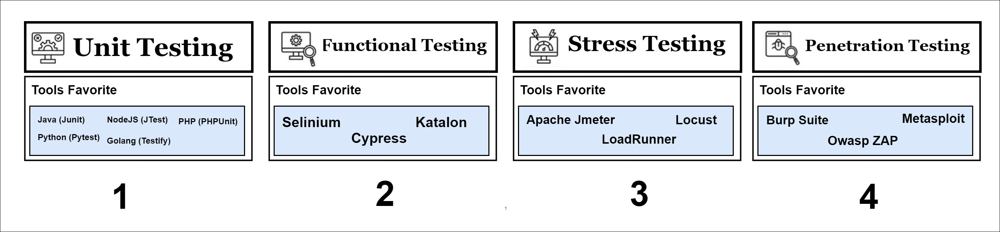

### 1. Unit Testing
This test focuses on checking the most basic logic inside the application code, such as ensuring the total shopping calculation function does not add up numbers incorrectly.

### 2. Functional Testing
This test ensures app features run correctly from the user's side, such as guaranteeing the "pay" button actually processes the order until finished.

### 3. Stress Testing
This test is done by flooding the application with thousands of users at once to see when the system will slow down or stop working.

### 4. Penetration Testing
This test is a simulated attack to find security loopholes in the application so that user data is not easily stolen by hackers.


## 2. What is Cypress & E2E Testing?

**Functional Testing** or **E2E (End-to-End) Testing** is a testing method where we simulate real user behavior from start to finish.

Cypress is a tool that allows us to perform that simulation automatically.

URL: https://www.cypress.io/

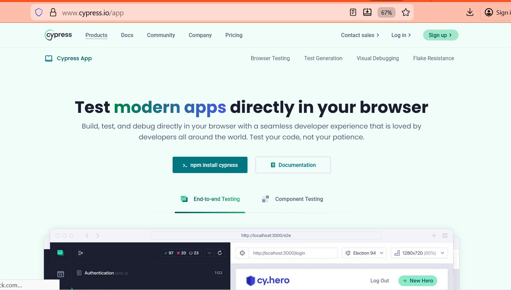


## 3. Best Practice Collaboration Scheme

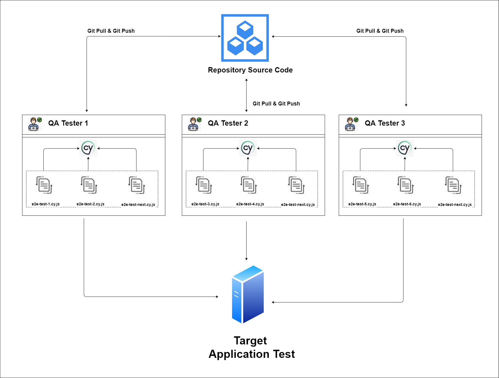

Cypress allows the QA (Quality Assurance) team to work in parallel. Each QA can work on a different business flow without overlapping each other.

## 4. Prerequisites

Before starting, you must install **Node.js** on your computer.

### 4.1. Download Node.js
Visit the official Node.js website and download the LTS (Long Term Support) version.

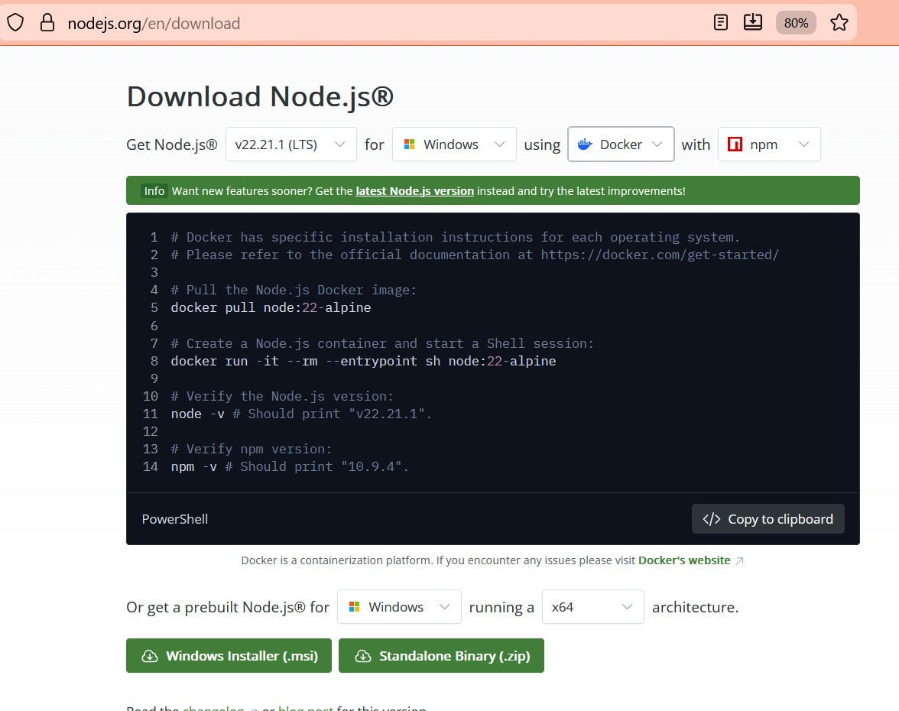
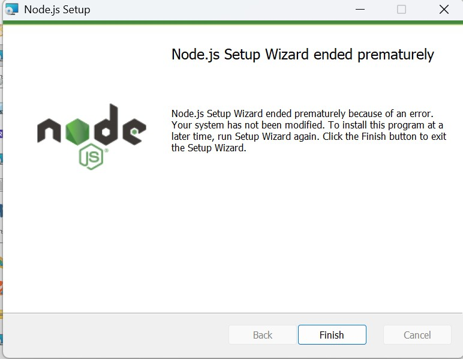

### 4.2. Check Installation
Open Terminal (Command Prompt/PowerShell) and type the following command to ensure the installation was successful:

```bash
node -v
npm -v
```

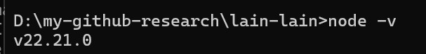
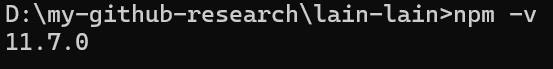


## 5. Project Installation

Let's make our first test project from zero.

**Steps:**

5.1.  **Create Project Folder**: Make a new folder on your computer, for example `project`.
2.  **Initialize Project**: Open the terminal inside that folder and type:
    ```bash
    npm init -y
    ```
    This will create a `package.json` file.

    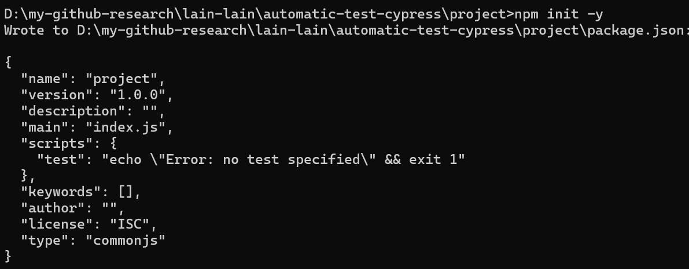

5.2.  **Install Cypress**: Type this command to download Cypress:
    ```bash
    npm install cypress --save-dev
    ```

5.3.  **Open Cypress**: After installation is done, open the Cypress application with the command:
    ```bash
    npx cypress open
    ```
    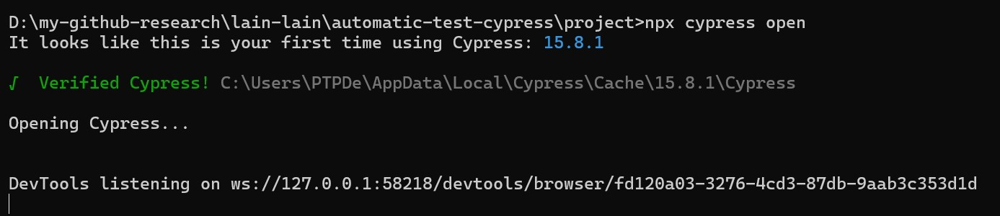
    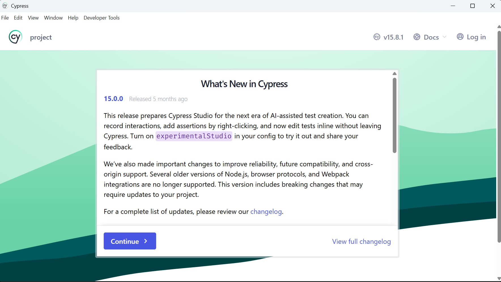
    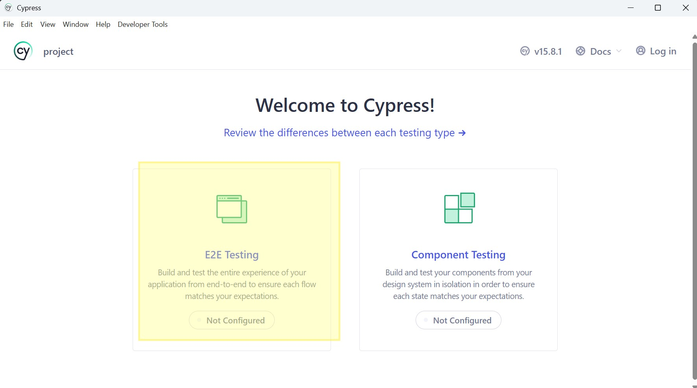
    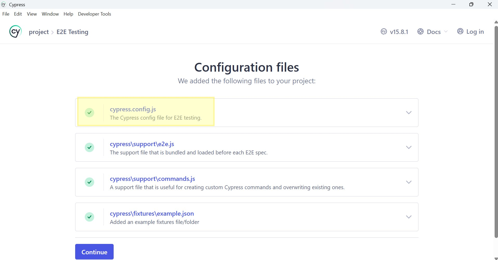
    
    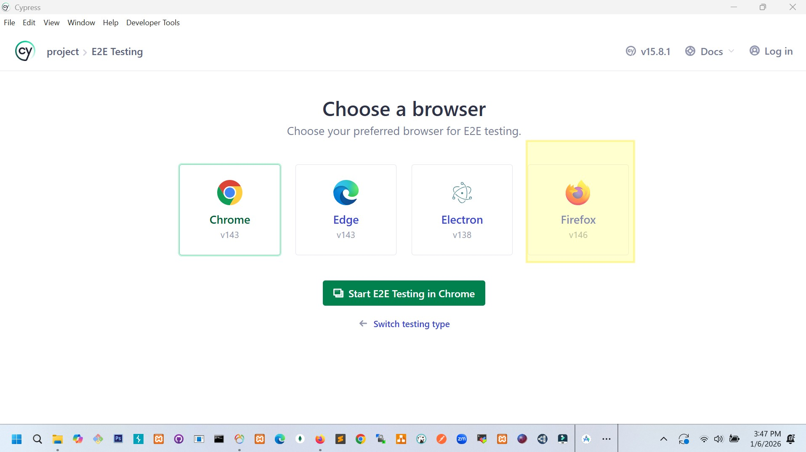


## 6. Understanding Folder Structure

After Cypress opens for the first time, it will automatically create several important folders. It is very important to understand their functions.

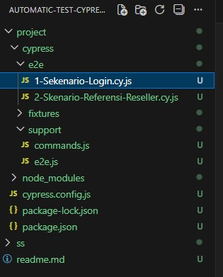

*   **`cypress/e2e`**:
    *   This is where your test "brain" is. All test scenario files (ending in `.cy.js`) are saved here.
*   **`cypress/fixtures`**:
    *   Place to save dummy/fake data (usually JSON format). Example: user data for login (username, password).
*   **`cypress/support`**:
    *   Place to put code that can be used repeatedly (reusable testing code) or *custom commands* to make the main test code neater.
*   **`cypress.config.js`**:
    *   Global configuration file for Cypress. You can set the base URL of the website to be tested here. -> 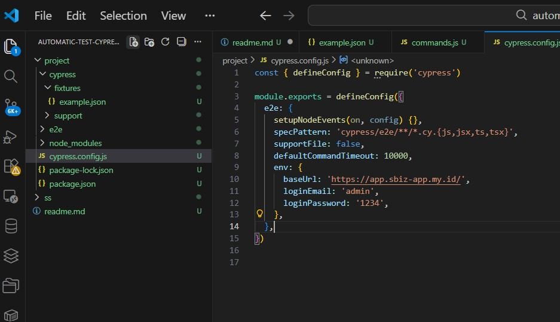


## 7. Basic Cypress Commands

Cypress uses human-friendly language that is easy to understand. Here is a "dictionary" of the most frequently used commands:

| Command | Function | Usage Example |
| :--- | :--- | :--- |
| **`cy.visit()`** | Opens a website address (URL). | `cy.visit('https://google.com')` |
| **`cy.get()`** | Finds an element on the page (button, text box). | `cy.get('#username')` |
| **`cy.type()`** | Types text into an input. | `cy.get('#username').type('budi123')` |
| **`cy.click()`** | Performs a click (button/link). | `cy.get('#btn-login').click()` |
| **`cy.contains()`** | Finds an element based on its text writing. | `cy.contains('Login Successful')` |
| **`cy.should()`** | Performs validation/checking (Assertion). | `cy.get('.alert').should('be.visible')` |
| **`cy.wait()`** | Waits for a few seconds (use wisely). | `cy.wait(1000)` (wait 1 second) |


## 8. Creating First Test Scenario

Let's make a scenario for **Login**.

1.  Create a new file in the `cypress/e2e` folder with the name `1-Login-Scenario.cy.js`.
2.  Write the following code (adjust selector with your target website):

```javascript
describe('Login Test Scenario', () => {
    
  it('User successfully logs in with valid data', () => {
    // 1. Open website page
    cy.visit('https://website-toko-online.com/login');

    // 2. Input Username
    cy.get('input[name="email"]').type('user@example.com');

    // 3. Input Password
    cy.get('input[name="password"]').type('secret123');

    // 4. Click Login Button
    cy.get('button[type="submit"]').click();

    // 5. Validation: Should redirect to Dashboard
    cy.url().should('include', '/dashboard');
    cy.contains('Welcome').should('be.visible');
  });

});
```
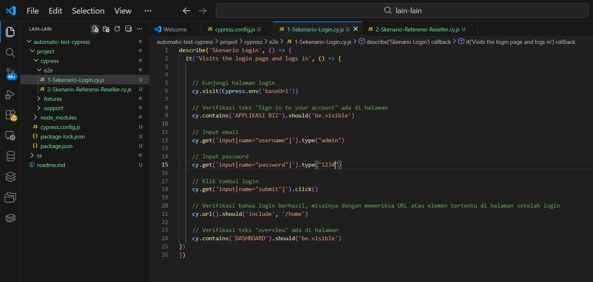


## 9. Running the Test

There are two ways to run your test robot:

### 9.1. Method 1: Using GUI (Visual Mode)
Suitable for debugging and seeing the robot's steps working.

1.  Run `npx cypress open`.
2.  Choose "E2E Testing".
3.  Choose browser (example: Chrome).
4.  Click file `1-Login-Scenario.cy.js`.
5.  Watch the robot work!

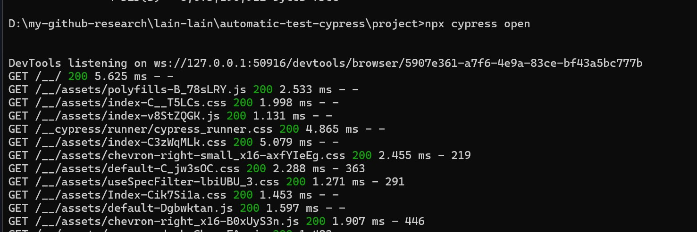

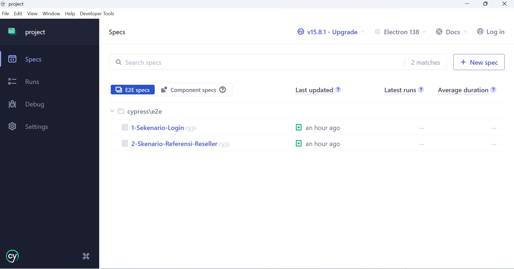

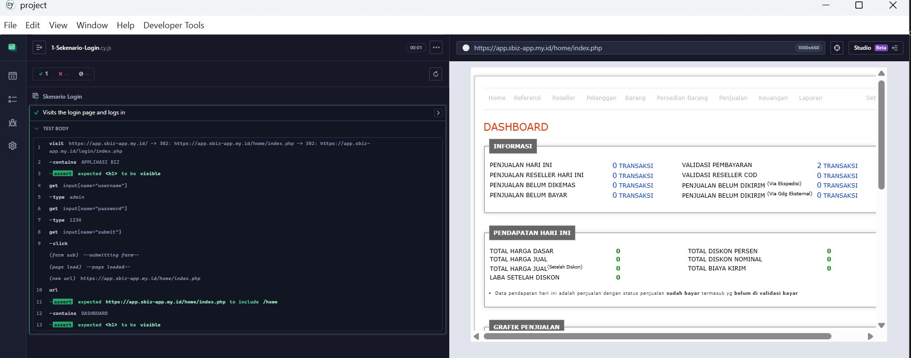


### 9.2. Method 2: Using CLI (Fast/Headless Mode)
Suitable to be run on a server or CI/CD, without opening the browser window.

Run this command in the terminal:

```bash
npx cypress run --spec "cypress/e2e/1-Skenario-Login.cy.js"
```

If the test is successful, you will see a green check report (✅).

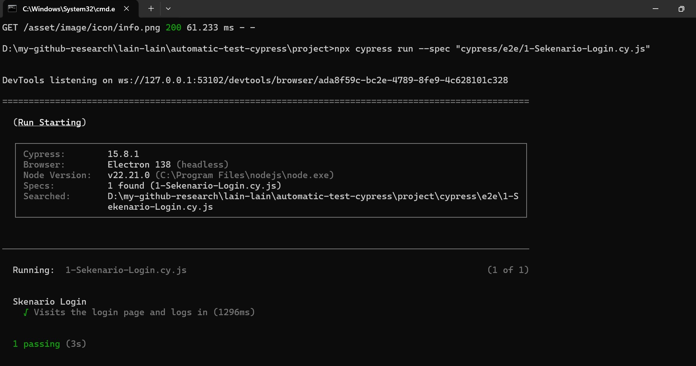

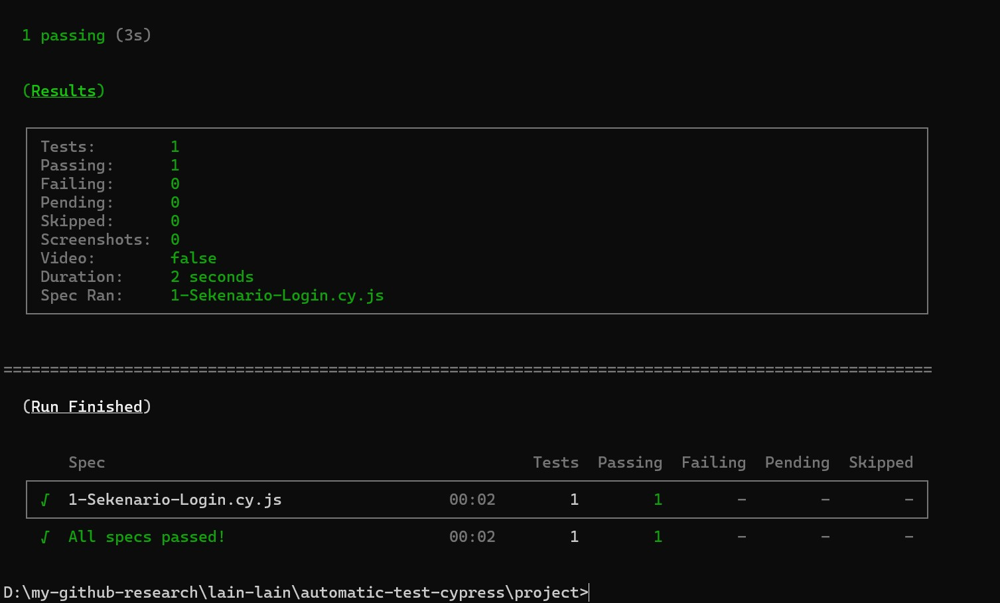


> **Extra Tips**:
> You can see all the cypress source code in the `project/` folder for clearer exploration.

